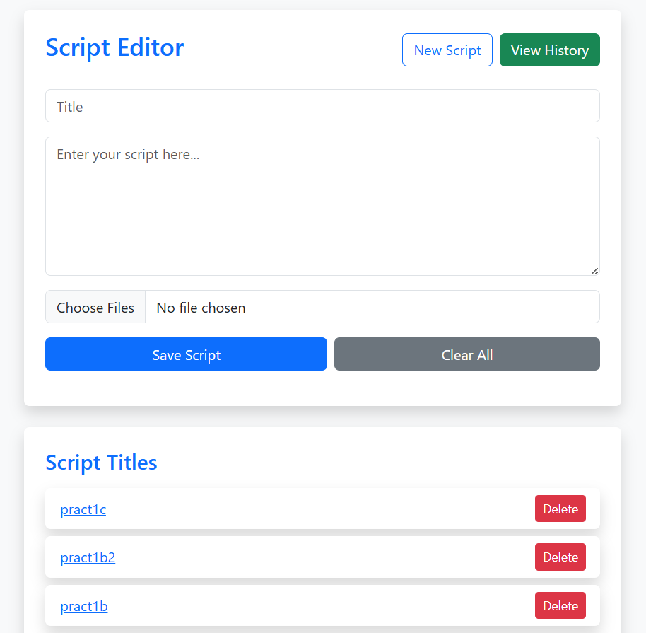
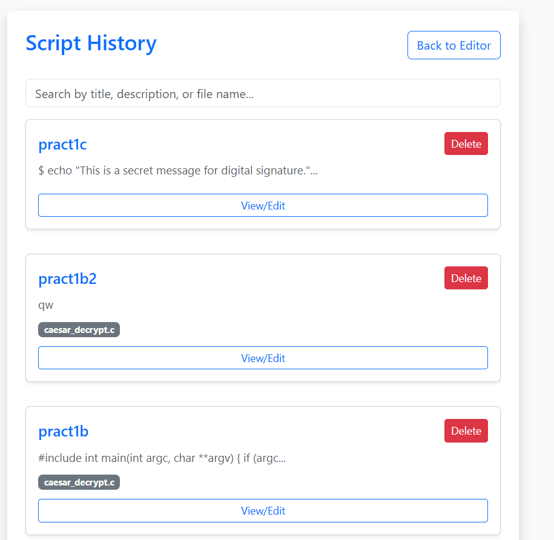

# Script Editor & LAN File Sharing

## Overview

**Flask Script Editor** is a web-based tool that allows users to create, edit, and manage scripts, as well as upload and share files with other machines on the same Local Area Network (LAN). The application supports a wide range of file formats, making it easy to collaborate and transfer files between devices.

Key features include:
- **Script creation and editing** with title and content fields.
- **Multi-format file uploads**: images, text files, Python scripts, PDFs, Word documents, C source files, and shell scripts.
- **History view** with search and filtering by title, content, or file name.
- **Modern, responsive UI** using Bootstrap.
- **RESTful API** for integration or automation.
- **LAN-friendly**: Easily accessible by any device on the same network.




---

## Setup Instructions

### 1. Clone the Repository

```sh
git clone https://github.com/ErnestTCY/ScriptEditor
```

### 2. Create and Activate a Virtual Environment

```sh
python -m venv venv
# On Windows:
venv\Scripts\activate
# On Linux/Mac:
source venv/bin/activate
```

### 3. Install Dependencies

```sh
pip install -r requirements.txt
```

### 4. Run the Flask Backend

```sh
python backend/app.py
```

By default, the server runs on `http://0.0.0.0:3001` (accessible from other LAN devices).

### 5. Access the App

Open your browser and go to:
```
http://<your-computer-ip>:3001/
```
(Replace `<your-computer-ip>` with your actual LAN IP address, e.g., `192.168.1.100`.)

---

## Usage

### Script Editor

- Enter a title and script content.
- Upload one or more files (supported: images, `.txt`, `.py`, `.pdf`, `.doc`, `.docx`, `.c`, `.sh`).
- Click **Save Script** to store your script and files.

### History Page

- View all previously saved scripts.
- Each entry shows the title, a brief description (first 10 words), and up to 2 file names.
- Use the search bar to filter scripts by title, content, or file name.
- Click **View/Edit** to open a script in the editor.
- Click **Delete** to remove a script and its files.

---

## API Endpoints

- `POST /api/scripts` — Save a script (title, content, files)
- `GET /api/scripts` — Get all scripts
- `GET /api/scripts/<id>` — Get a script by ID
- `PUT /api/scripts/<id>` — Update a script by ID
- `DELETE /api/scripts/<id>` — Delete a script by ID
- `/uploads/<filename>` — Serve uploaded files

---

## File Storage

- Uploaded files are stored in the `uploads/` directory.
- The SQLite database (`backend/scripts.db`) stores script metadata and file references.

---

## Dependencies

- Flask
- Flask-Cors

Install with:
```sh
pip install -r requirements.txt
```

---

## Security Notes

- This tool is intended for use on trusted LANs. For public or production deployment, add authentication and further security measures.
- Uploaded files are not scanned for malware—use caution when sharing files.

---

## License

@Copyright Ernest Tan Cong Ying 2025
---

## Credits

Developed by Ernest Tan Cong Ying.  
Contributions and feedback are welcome! 
